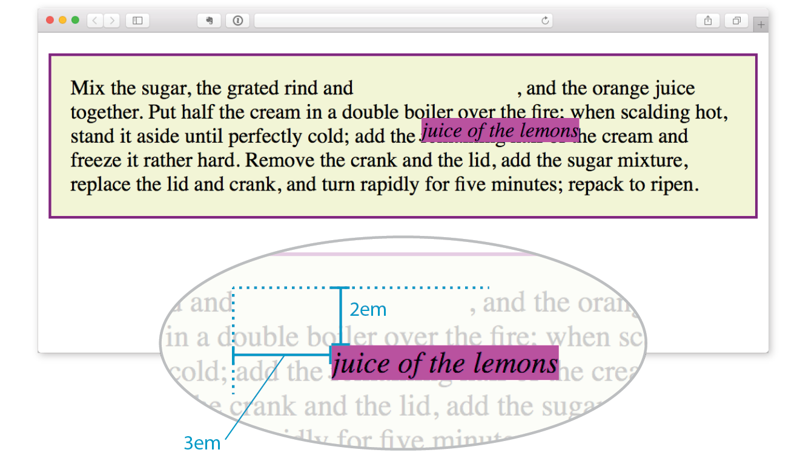
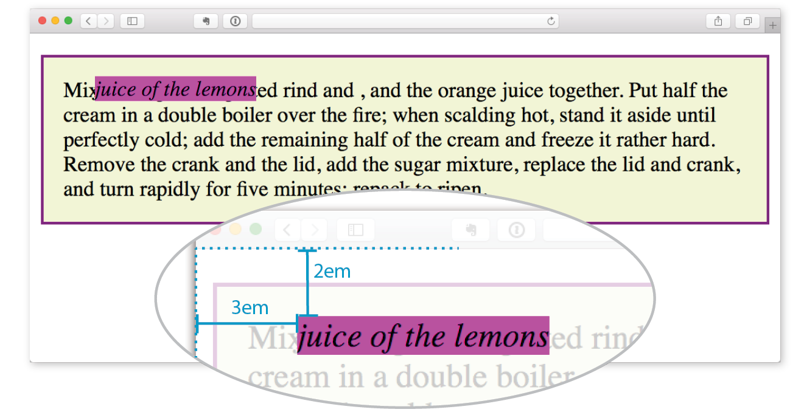
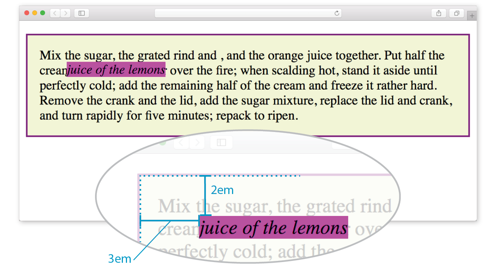

# Layout and Positioning

- Spacing with padding and margin
  - paddings create extra space *within* an element
  - margins create extra space *around* an element
- the `position` property
  - values: `static`, `relative`, `absolute`, `fixed`, or `sticky`
- the `z-index` property
  - it aware of stacking contexts
- the `float` property
  - values: `right`, `left`, `inline-start`, or `inline-end`
  - the `clear` property
    - values: `none`, `right`, `left`, `both`, `inline-start`, or `inline-end`

## Paddings

- By default, most elements have zero padding.
- An element's padding is not inherited by its children.
- The `%` unit is defined as a percentage of the element's width.
- A `background-color` extends underneath the content and padding box of the element.

## Margins

- By default, most elements have no margin.
- The size of the margin as a percentage, relative to the inline size (width in a horizontal language) of the containing block.

When the horizontal margin is set to `auto`,

- the element takes up the specified width, and
- the margin is *automatically* distributed evenly between the left and right margins; therefore
- the element is centered horizontally within its containing element.

## Margin collapse

Vertical margins collapse:

- When two elements with a vertical margin meet vertically, the two margins are *collapsed* into a single margin.
  - If they are the same size, then the collapsed margin will be the same size as the common margin.
  - If they are different sizes, the collapsed margin will take the size of the larger margin.
- When there is no border, padding, or other content between a parent and its child, the top and bottom margins of the inner element are collapsed (removed).
  - If the outer element has, say, a padding, we can see the margins of the inner element.

## Positioning elements

The CSS `position` property determines how an element is positioned, including *static*, *relative*, *absolute*, *fixed*, or *sticky*.

### `static`

A statically positioned element is positioned in the normal flow of the document. `static` is the default value of the `position` property. The `top`, `right`, `bottom`, and `left` properties have no effect.

A statically-positioned block element will, by default, take up the full width of its container.

### `relative`

A relatively positioned element is positioned relative to where it would normally appear in the flow of the document. The `top`, `right`, `bottom`, and `left` properties determine the offset.

The other elements in the document flow are not affected; they remain at their original positions in the document flow.

A relatively-positioned block element will, by default, take up the full width of its container.

### `absolute`

An absolutely positioned element is removed from the document flow and *floats* above it. The layout of other elements will be adjusted as if the absolutely positioned element is not there.

The `top`, `right`, `bottom`, and `left` offsets are relative to the *closest ancestor positioned element*. This is not necessarily the element’s direct parent.

An absolutely-positioned block element will only be as wide as it needs to be to fit its content. Add a `width: 100%` to the element if the full width behavior is still desired.

### `fixed`

A fixed element is removed from the document flow.

The `top`, `right`, `bottom`, and `left` offsets are relative to the viewport. Even if the page is scrolled, a fixed element will remain in the same position, useful for a fixed header or navigation bar.

An fixed block element will only be as wide as it needs to be to fit its content. Add a `width: 100%` to the element if the full width behavior is still desired.

### `sticky`

It is not supported in Internet Explorer.

A sticky element acts as a relatively positioned element, scrolling with the document. When the element reaches a point specified via a `top`, `right`, `bottom`, or `left` value, then it turns into a fixed element.

## Containing blocks

This section is based on *Learning Web Design 5th Edition* by Jennifer Robbins, the section *Containing blocks* in Chapter 15.

Here I’ve positioned an inline `em` element (FIGURE 15-19).

```
em {
  position: relative;
  top: 2em;
  left: 3em;
  background-color: fuchsia;
}
```



FIGURE 15-19. When an element is positioned with the `relative` method, the space it would have occupied is preserved.

Let’s take the same example as shown in FIGURE 15-19, only this time we’ll change the value of the `position` property to `absolute` (FIGURE 15-20):

```
em {
  position: absolute;
  top: 2em;
  left: 3em;
  background-color: fuchsia;
}
```



FIGURE 15-20. When an element is absolutely positioned, it is removed from the flow and the space is closed up.

The most significant difference here, however, is the location of the positioned element. This time, the offset values position the em element 2em down and 3em to the right of the top-left corner of the *viewport* (browser window).

What actually happens in absolute positioning is that the element is positioned relative to its nearest *containing block*. It just so happens that the nearest containing block in FIGURE 15-20 is the root (`html`) element, also known as the *initial containing block*, so the offset values position the `em` element relative to the whole document.

The CSS Positioned Layout Module, Level 3, states,

> The position and size of an element's box(es) are sometimes computed relative to a certain rectangle, called the *containing block* of the element.

It is critical to be aware of the containing block of the element you want to position. We sometimes refer to this as the *positioning context*.

The spec lays out a number of intricate rules for determining the containing block of an element, but it basically boils down to this:

- If the positioned element is *not* contained within another positioned element, then it will be placed relative to the initial containing block (created by the `html` element).
- But if the element has an ancestor (i.e., is contained within an element) that has its position set to `relative`, `absolute`, or `fixed`, the element will be positioned relative to the edges of *that* element instead.

In the next example, we'll keep the style rule for the `em` element the same, but we'll add a position property to the `p` element, thus making it the containing block for the positioned `em` element.

```
p { 
  position: relative;
  padding: 15px;
  background-color: #F2F5D5;
  border: 2px solid purple;
}
```



FIGURE 15-21. The relatively positioned `p` element acts as a containing block for the `em` element.

You can see that the `em` element is now positioned `2em` down and `3em` from the top-left corner of the paragraph box, not the browser window.

Notice also that it is positioned relative to the padding edge of the paragraph (just inside the border), not the content area edge. This is the normal behavior when block elements are used as containing blocks.

When inline elements are used as containing blocks (and they can be), the positioned element is placed relative to the content area edge, not the padding edge.

## `z-index` and stacking contextx

Give the `.header` a `z-index` of 100 and the `.overlay` a `z-index` of 200.

- The `.overlay` appears on top of the `.header`, because the `.overlay` has a higher `z-index` than the `.header`.
- Without the `z-index` values, the `.header` is not obscured by the `.overlay`; rather, it sits on top of it.


```html
<style>
  .header {
    background-color: red;
    color: white;
    height: 1rem;
    left: 0;
    padding: 1rem;
    position: fixed;
    top: 0;
    width: 100%;
    z-index: 100;
  }
  .body {
    margin-top: 3.5rem;
  }
  .overlay {
    background-color: rgba(0, 0, 0, 0.5);
    height: 100%;
    left: 0;
    position: absolute;
    top: 0;
    width: 100%;
    z-index: 200;
  }
</style>
<div class="overlay"></div>
<div class="container">
  <div class="header">Header</div>
  <div class="body">
    Some other page content
  </div>
</div>
```

`z-index` doesn't control an element's z-axis ordering globally within the entire document. It only controls the ordering relative to other elements within a given *stacking context*.

Initially, there is one stacking context, formed by the root of the document (the `<html>` element). Within the document, there are certain other elements that will create a new stacking context:

- Any element that has
  - a `position` other than `static` and
  - a `z-index` other than `auto`
- Any element with
  - an `opacity` less than 1
- Any element that is
  - a child of a `flex` or `grid` container and
  - a `z-index` other than `auto`

If no `z-index` is given, there are certain stacking rules that are applied inside a stacking context. These are, from bottom to top:

- The background and borders of the element that creates the stacking context
- Descendant elements of the element that creates the stacking context that are not positioned
- Descendant elements of the element that creates the stacking context that are positioned

These rules, in conjunction with explicitly set `z-index` properties, determine the final stacking order of elements.

## Floats

When the `float` property is applied to an element, it is removed from the flow of the document. It then *floats* to the left or right, stopping when it reaches the edge of the containing element, or another floated element.

```html
<style>
  .container {
    width: 10rem;
  }
  .floating,
  .floating-2 {
    float: right;
    height: 3rem;
    width: 3rem;
  }
  .floating {
    background-color: red;
  }
  .floating-2 {
    background-color: blue;
  }
</style>
<div class="container">
  <div class="floating"></div>
  <div class="floating-2"></div>
  Lorem ipsum dolor sit amet, consectetur adipiscing elit.
  Donec nec sapien dolor. 
  Nunc condimentum sem nec commodo sollicitudin.
</div>
```

First, the red box is floated right, to the edge of the container. Next, the blue box is floated right, to the edge of the red box. Other inline elements (text in the example) will flow around it.

The `clear` property can be used on an element to indicate that it can't be alongside a floated element in a given direction. The `clear` property can be `none` (the default), `left`, `right`, `both`, `inline-start`, or `inline-end`. If an element is cleared in a given direction, and there is a floated element there, the element will be moved so that it is *below* the floated element.

```html
<style>
  .container {
    width: 10rem;
  }
  .floating {
    background-color: red;
    float: right;
    height: 3rem;
    width: 3rem;
  }
  .floating-2 {
    background-color: blue;
    float: left;
    height: 5rem;
    width: 3rem;
  }
  .content {
    clear: right;
  }
</style>
<div class="container">
  <div class="floating"></div>
  <div class="floating-2"></div>
  <div class="content">
    Lorem ipsum dolor sit amet, consectetur adipiscing elit.
    Donec nec sapien dolor. 
    Nunc condimentum sem nec commodo sollicitudin.
  </div>
</div>
```

The content has been moved to below the right-floated red box. Since the blue box on the left is taller, it is allowed to be floated alongside the content.
