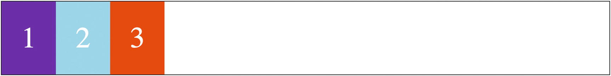
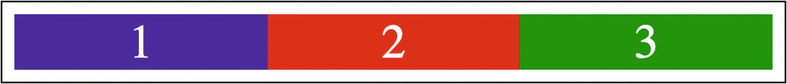
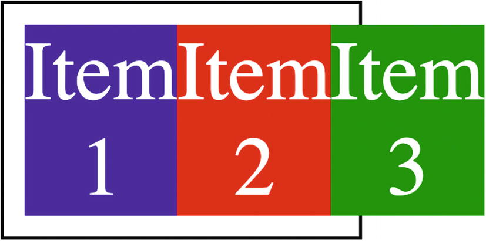

# Flexbox

Flexbox is a one-dimensional layout that can lay out elements either horizontally or vertically (but not both). An element using flexbox as its layout is referred to as a *flex container*, and the elements inside it are *flex items*.

## Basic concepts

Setting an element's `display` property

- to `flex` makes the element a block flex container
- to `inline-flex` an inline flex container

### Direction

A flex container has a direction, defined by the `flex-direction` property:

- horizontal: `row` or `row-reverse`
- vertical: `column` or `column-reverse`

### Axis

For flex containers with a horizontal direction,

- the *main axis* goes hrizontally
- the *cross axis* vertically

## A basic flex layout

```html
<style>
  .container {
    display: flex;
    flex-direction: row;
    border: 1px solid black;
  }
  .item {
    font-size: 3rem;
    padding: 2rem;
    color: white;
  }
  .one {
    background: rebeccapurple;
  }
  .two {
    background: skyblue;
  }
  .three {
    background: orangered;
  }
</style>
<div class="container">
  <div class="item one">1</div>
  <div class="item two">2</div>
  <div class="item three">3</div>
</div>
```

The rendered layout is



Figure 10-3. A basic flex layout

Normally, a block element would start on a new line. But inside a flex container, this doesn't happen. The items are instead laid out *along the main axis*.

Also notice that:

- the height of the container is just enough to fit its content, and
- the items are right up against each other – the flex container does not add any gap between its items.

## Sizing

```html
<style>
  .container {
    border: 1px solid black;
    padding: 0.5rem;
    width: 500px;
    display: flex;
    flex-direction: row;
  }
  .item {
    width: 300px;
    text-align: center;
    color: white;
    font-size: 2rem;
  }
  .one {
    background: blue;
  }
  .two {
    background: red;
  }
  .three {
    background: green;
  }
</style>
<div class="container">
  <div class="item one">1</div>
  <div class="item two">2</div>
  <div class="item three">3</div>
</div>
```

The preceding code results in the layout



Figure 10-4. Flex items are shrunk to fit the container

The container only has a width of 500px and contains three items, each with a width of 300px. Yet, the items fit neatly inside the container and don’t overflow. In cases like this, the browser will try to shrink flex items to fit the container.

Sometimes, the elements can be shrunk down as small as possible but still not fit within the container. When this happens, the items then will overflow the container.

```html
<style>
  .container {
    border: 1px solid black;
    padding: 0.5rem;
    width: 120px;
    display: flex;
    flex-direction: row;
  }
  .item {
    width: 300px;
    text-align: center;
    color: white;
    font-size: 2rem;
  }
  .one {
    background: blue;
  }
  .two {
    background: red;
  }
  .three {
    background: green;
  }
</style>
<div class="container">
  <div class="item one">Item 1</div>
  <div class="item two">Item 2</div>
  <div class="item three">Item 3</div>
</div>
```



Figure 10-5. Contents overflow the container

There are several properties that affect flex item sizing. Some of these properties are set on the flex container, and others are set on the flex items.

| property      | apply to  | description
|---------------|:---------:|-------------
| `flex-wrap`   | container | its items will wrap to the next line
| `flex-grow`   | item      | how each item grows to fill space
| `flex-shrink` | item      | how each item shrinks to fill space
| `flex-basis`  | item      | the initial size of a flex item

## Alignment and spacing

*Alignment*: what happens when all the items are not the same size in the cross axis?

*Spacing*: how is leftover space distributed?

