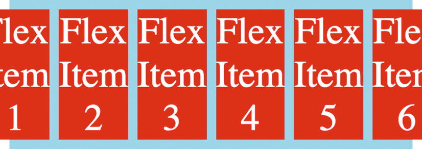
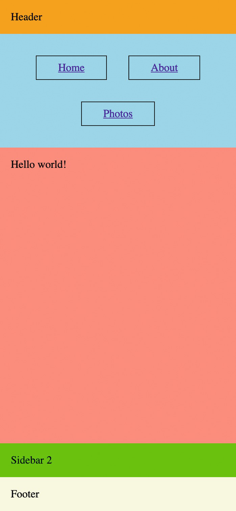

# Responsive Design

## Media queries

*Media queries* are one of the main tools used for responsive design, as are flexbox and CSS Grid.

You will need to add the viewport meta tag to your HTML inside the head element:

```html
<meta
  name="viewport"
  content="width=device-width, initial-scale=1.0">
```
A media query is defined as an at-rule, `@media`. It specifies a medium (`all`, `print`, `screen`, or `speech`) and a condition. If no medium is specified, it defaults to `all`. If the condition is met, the CSS rules inside the block are applied to the document. If it is not met, the CSS rules are ignored.

```css
h1 {
  font-size: 5rem;
}
@media screen and (max-width: 785px) {
  h1 {
    font-size: 3rem;
  }
}
@media screen and (max-width: 480px) {
  h1 {
    font-size: 2rem;
  }
}
```

With responsive design, the `min-width` and `max-width` rules are commonly used, as they are good indicators of viewport size. Other media queries include:

- `@media (orientation: landscape)`
- `@media (prefers-color-scheme: dark)`

Media queries can also be used to conditionally load an entire style sheet.

```html
<link rel="stylesheet"
      href="screen.css"
      media="screen">
<link rel="stylesheet"
      href="print.css"
      media="print">
```

## Breakpoints

A breakpoint is the threshold at which a page’s layout will change due to the viewport size with a media query.

It's better to set breakpoints based on the content.
- try to avoid targeting specific devices with media queries
- experiment with different viewport sizes, and find the points where your layout and design start looking cramped

## Responsive with flexbox

Some responsive layouts can be achieved without even using media queries. For example, we can use the `flex-wrap` property on a flex container to automatically wrap elements to the next line if the viewport is too narrow, in order to prevent the need for horizontal scrolling.

The flex items have shrunk as much as possible, but the viewport still isn’t wide enough, so the first and last items get cut off.



Figure 11-9. The layout with an even narrower viewport

We can easily solve this problem by setting `flex-wrap` to `wrap` on the container.

## Fluid typography

With fluid typography, it’s possible to automatically scale the font size to viewport size without having to use media queries.

We can use `vw` to specify a font size as a proportion of the viewport width. For example, for a 1,000-pixel-wide viewport, `1vw` is equal to `10px`. Suppose that we want our header to have a font size of `48px` for a 1,000-pixel-wide viewport. We can specify the font-size as `4.8vw`.

```css
h1 {
  font-size: clamp(48px, 4.8vw, 64px);
}
```

The font size adjusts automatically with the viewport width as before, but it will never drop below `48px` or go above `64px`.

## Responsive images

Images can scale with the viewport width without using media queries.

```css
img {
  max-width: 100%;
  height: auto;
}
```

As we resize the viewport, the image is resized and maintains the proper aspect ratio.

## Adapting a layout with media queries

There are still good use cases for media queries with responsive design, however.

```html
<style>
  body {
    margin: 0;
  }
  .container {
    display: flex;
    flex-direction: column;
    height: 100vh;
  }
  .header {
    background: orange;
    padding: 1rem;
  }
  .main {
    display: flex;
    flex-direction: row;
    flex-grow: 1;
  }
  .content {
    background: salmon;
    padding: 1rem;
    flex-grow: 1;
  }
  .sidebar {
    display: flex;
    flex-direction: column;
    background: skyblue;
    padding: 1rem;
  }
  .sidebar a {
    margin: 1rem;
    padding: 0.5rem 2rem;
    border: 1px solid black;
  }
  .sidebar2 {
    background: lime;
    padding: 1rem;
  }
  .footer {
    background: beige;
    padding: 1rem;
  }
</style>
<div class="container">
  <header class="header">Header</header>
  <main class="main">
    <nav class="sidebar">
      <a href="/home">Home</a>
      <a href="/about">About</a>
      <a href="/photos">Photos</a>
    </nav>
    <div class="content">
      Hello world!
    </div>
    <div class="sidebar2">
      Sidebar 2
    </div>
  </main>
  <footer class="footer">Footer</footer>
</div>
```

Add a media query:

```css
@media screen and (max-width: 700px) {
  .main {
    flex-direction: column;
  }
  .sidebar {
    flex-direction: row;
    justify-content: center;
    flex-wrap: wrap;
  }
}
```

This will
- stack the three regions (`.sidebar`, `content`, and `sidebar2`) vertically, allowing them each to take up the full width of the container
- change the navigation links to be horizontal and let them wrap with a narrower viewpoint



Figure 11-23. Adding `flex-wrap: wrap`
