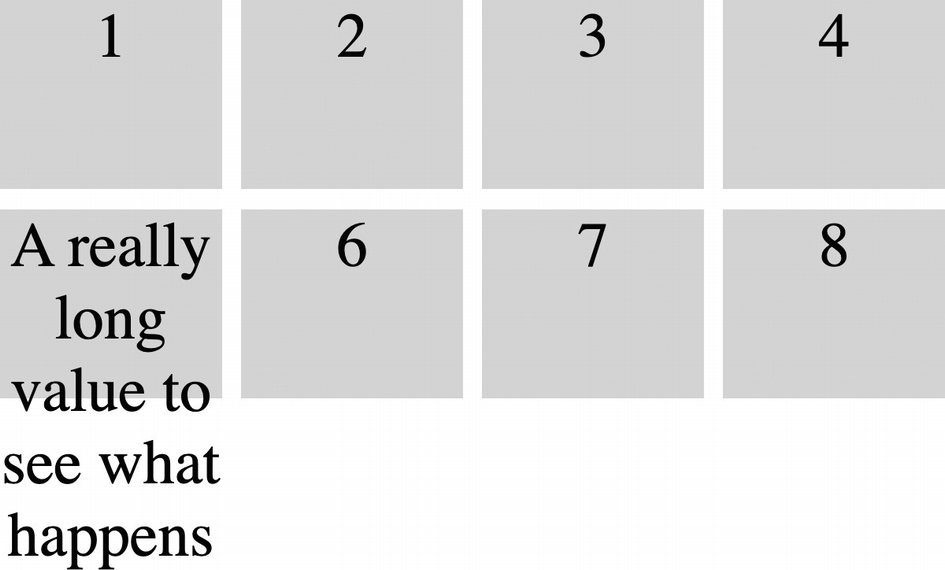
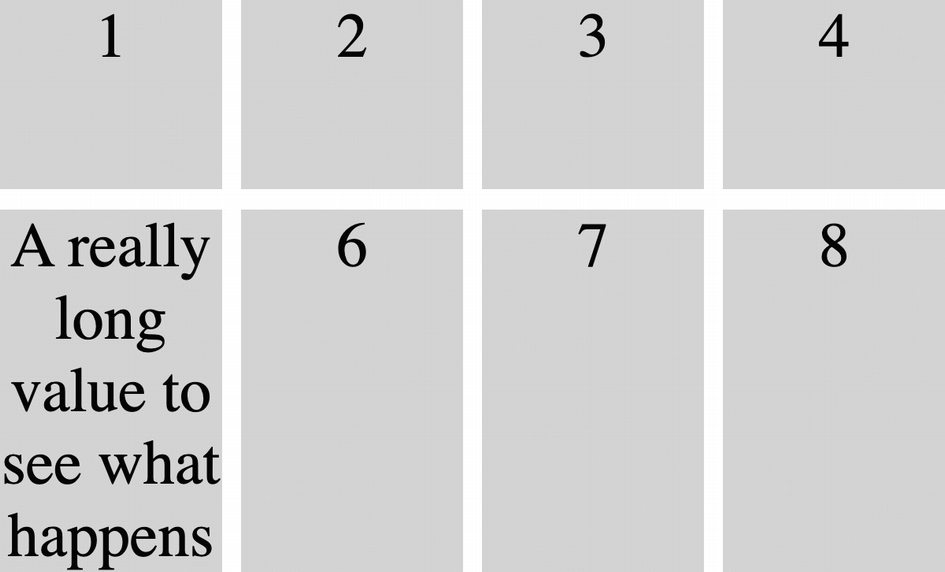

# CSS Grid

- Flexbox is a one-dimensional layout where items are arranged horizontally or vertically in rows or columns.
- CSS Grid allows you to create two-dimensional grid layouts with rows and columns.

## Basic concepts

```html
<style>
  .wrapper {
    display: grid;
    grid-template-columns: 200px 200px 200px;
  }
</style>
<div class="wrapper">
  <div>One</div>
  <div>Two</div>
  <div>Three</div>
  <div>Four</div>
  <div>Five</div>
</div>
```

```
+-------+-------+-------+
| One   | Two   | Three |
+-------+-------+-------+
+-------+-------+
| Four  | Five  |
+-------+-------+
```

- *Grid containers*: To make an element a grid container, set its `display` property to `grid` or `inline-grid`.
- *Grid items*: are all immediate children of the grid container (descendant elements are not).
- *Grid lines*: divide the rows and columns of the grid.
- A *grid track*: is the space (rows and columns) between any two adjacent lines on the grid.
- A *grid area*: is the space (a single or multiple cells) enclosed by any four grid lines.

Explict and implicit grids:
- When grid rows and columns are explicitly defined with CSS properties, this is known as the *explicit grid*.
- If more items are added than are accounted for in the explicit grid, the grid layout creates additional rows and/or columns to fit these extra items. This is the *implicit grid*.

Grid sizes can be specified with any of the units we’ve looked at so far – `px`, `em`, `rem`, even percentages. CSS Grid introduces a new unit, the `fr` unit . This is a fractional unit that refers to a fraction of the free space.

### The `grid-template-rows` and `grid-template-columns` properties

To set up the rows and columns of the explicit grid, the `grid-template-rows` and `grid-template-columns` properties are used. These are used to specify the widths of the rows and the heights of the columns, respectively. Technically speaking, they are used to specify the size of the grid tracks.

```html
<style>
  .container {
    display: grid;
    grid-template-columns: 10rem 10rem;
    grid-template-rows: 5rem 5rem;
    gap: 5px;
  }
  .item {
    background: lightgray;
    text-align: center;
  }
</style>
<div class="container">
  <div class="item">1</div>
  <div class="item">2</div>
  <div class="item">3</div>
  <div class="item">4</div>
  <div class="item">5</div>
  <div class="item">6</div>
</div>
```

### The `grid-auto-rows` property

Items 5 and 6 are in the implicit grid. Also notice that they are automatically sized to fit their content. This is the default behavior for implicit grid items. This behavior can be controlled with the `grid-auto-rows` property, where we specify the sizing for implicit grid rows.

```html
<style>
  .container {
    display: grid;
    grid-template-columns: 10rem 10rem;
    grid-template-rows: 5rem 5rem;
    grid-auto-rows: 5rem;
    gap: 5px;
  }
```

## Grid sizing

Each of the three columns is set to `1fr` with the `grid-template-columns` property. This means the free space (`width: 30rem`) will be divided evenly between all three columns.

```html
<style>
  .container {
    display: grid;
    grid-template-columns: 1fr 1fr 1fr;
    grid-template-rows: 5rem 5rem;
    grid-auto-rows: 5rem;
    gap: 5px;
    width: 30rem;
  }
```

### The `repeat` function

Sometimes, defining grid sizes can be repetitive. For these cases, we can use the `repeat` function:

```html
<style>
  .container {
    display: grid;
    grid-template-columns: repeat(3, 1fr);
    grid-template-rows: repeat(2, 5rem);
    grid-auto-rows: 5rem;
    gap: 5px;
    width: 30rem;
  }
```

### The `minmax` function

If we use a fixed size for a row track, and a cell’s contents do not fit within the cell, the contents will overflow:



Figure 12-9 Overflowing cell content

To fix this scenario, we can use the `minmax` function. The function takes two arguments – the minimum size of the track and the maximum size.

```html
<style>
  .container {
    display: grid;
    grid-template-columns: repeat(4, 1fr);
    grid-template-rows: repeat(2, minmax(3rem, auto));
    gap: 5px;
    width: 15rem;
  }
</style>
```

Now the rows have a minimum height of `3rem` but can grow to automatically fit the content if necessary.



## `auto-fill` and `auto-fit`

Sometimes, we may not want to specify an exact number of rows or columns in a grid. For example, we may want to simply fit as many columns as will fit into the container's width. For this, we can use the `auto-fill` keyword in combination with the `repeat` function

```html
<style>
  .container {
    display: grid;
    grid-template-columns: repeat(auto-fill, 5rem);
    grid-template-rows: 5rem;
    grid-auto-rows: 5rem;
    gap: 5px;
  }
  .item {
    background: lightgray;
  }
</style>
```

- If the viewport is wide enough, all items will appear in a single row.
- If we resize the viewport so that they don’t all fit, the grid will set as many columns as will fit in the available space. The remaining grid items will wrap to the next row.

When there is more space than there are columns, with `auto-fill`, new columns are created which take up space in the container.

```
+---+---+---+---+---+---+-----+
| 1 | 2 | 3 | 4 | 5 | 6 |     |
+---+---+---+---+---+---+-----+
```

With `auto-fit`, however, it instead sizes the items to fit within the available space without adding more columns.

```
+----+----+----+----+----+----+
| 1  | 2  | 3  | 4  | 5  | 6  |
+----+----+----+----+----+----+
```

