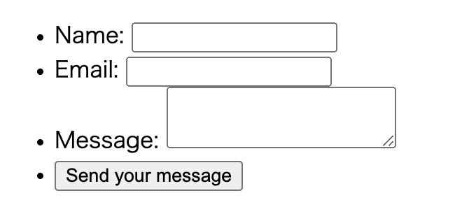
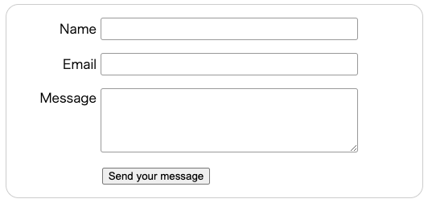

# Your first form

It's beyond the scope of this article to cover the user experience of forms, but if you want to dig into that topic you should read the following articles:

- Smashing Magazine has some [good articles about forms UX](https://www.smashingmagazine.com/2018/08/ux-html5-mobile-form-part-1/), including an older but still relevant [Extensive Guide To Web Form Usability](https://www.smashingmagazine.com/2011/11/extensive-guide-web-form-usability/) article.
- UXMatters is also a very thoughtful resource with good advice from [basic best practices](https://www.uxmatters.com/mt/archives/2012/05/7-basic-best-practices-for-buttons.php) to complex concerns such as [multi-page forms](https://www.uxmatters.com/mt/archives/2010/03/pagination-in-web-forms-evaluating-the-effectiveness-of-web-forms.php).

In this article, we'll build a simple contact form.


## Form HTML

Our contact form is not complex: the data entry portion contains three text fields, each with a corresponding `<label>`:

- The input field for the name is a *single-line text field*.
- The input field for the email is an *input of type email*: a single-line text field that accepts only email addresses.
- The input field for the message is a `<textarea>`; a *multiline text field*.

```html
<form action="/my-handling-form-page" method="post">
  <ul>
    <li>
      <label for="name">Name:</label>
      <input type="text" id="name" name="user_name" />
    </li>
    <li>
      <label for="mail">Email:</label>
      <input type="email" id="mail" name="user_email" />
    </li>
    <li>
      <label for="msg">Message:</label>
      <textarea id="msg" name="user_message"></textarea>
    </li>
    <li class="button">
      <button type="submit">Send your message</button>
    </li>
  </ul>
</form>
```

This `<form>` looks like:



Note the use of the for attribute on all `<label>` elements, which takes as its value the `id` of the form control with which it is associated — this is how you associate a form control with its label.

There is great benefit to doing this — it

- associates the label with the form control, enabling mouse, trackpad, and touch device users to click on the label to activate the corresponding control, and it also
- provides an accessible name for screen readers to read out to their users.

`<input type="email">` defines a single-line text field that only accepts a well-formed email address.

- This turns a basic text field into a kind of "intelligent" field that will perform some validation checks on the data typed by the user.
- It also causes a more appropriate keyboard layout for entering email addresses (e.g. with an `@` symbol by default) to appear on devices with dynamic keyboards, like smartphones.

The `<button>` element also accepts a type attribute: `submit`, `reset`, or `button`.

- A click on a `submit` button (the default value) sends the form's data to the web page defined by the action attribute of the `<form>` element.
- A click on a `reset` button resets all the form widgets to their default value immediately. From a UX point of view, this is considered **bad practice**, so you should avoid using this type of button unless you really have a good reason to include one.
- A click on a `button` button does nothing! That sounds silly, but it's amazingly useful for building custom buttons — you can define their chosen functionality with JavaScript.

**Note**: You can also use the `<input>` element with the corresponding type to produce a button, for example `<input type="submit">`. The main advantage of the `<button>` element is that the `<input>` element only allows plain text in its label whereas the `<button>` element allows full HTML content, allowing more complex, creative button content.

## Form styling

```html
    <style>
      form {
        margin: 0 auto;
        padding: 1em;
        border: 1px solid #ccc;
        border-radius: 1em;
      }
      ul {
        list-style: none;
        padding: 0;
        margin: 0;
      }
      form li + li {
        margin-top: 1em;
      }
      label {
        display: inline-block;
        width: 6em;
        text-align: right;
      }
      input,
      textarea {
        font: 1em sans-serif;
        width: 20em;
        box-sizing: border-box;
        border: 1px solid #999;
        border-radius: 3px;
      }
      input:focus,
      textarea:focus {
        border-color: #000;
      }
      textarea {
        vertical-align: top;
        height: 5em;
      }
      .button {
        padding-left: 6em;
      }
      button {
        margin-left: 0.5em;
      }
    </style>
```



## Sending form data

In our example, the form will send 3 pieces of data named "`user_name`", "`user_email`", and "`user_message`". That data will be sent to the URL "`/my-handling-form-page`" using the HTTP POST method.

On the server side, the script at the URL "`/my-handling-form-page`" will receive the data as a list of 3 key/value items contained in the HTTP request.
