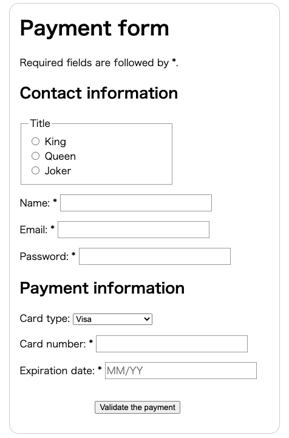

# How to structure a web form

**Warning**: It's strictly forbidden to nest a form inside another form. Nesting can cause forms to behave unpredictably, so it is a bad idea.

## Payment form

```html
<!DOCTYPE html>
<html lang="ja">
  <head>
    <meta charset="utf-8" />
    <meta name="viewport" content="width=device-width" />
    <title>Payment form</title>
    <link href="payment-form.css" rel="stylesheet" />
  </head>
  <body>
    <form>
      <h1>Payment form</h1>
      <p>
        Required fields are followed by
        <strong><span aria-label="required">*</span></strong>.
      </p>
      <section>
        <h2>Contact information</h2>
        <fieldset>
          <legend>Title</legend>
          <ul>
            <li>
              <label for="title_1">
                <input type="radio" id="title_1" name="title" value="K" />
                King
              </label>
            </li>
            <li>
              <label for="title_2">
                <input type="radio" id="title_2" name="title" value="Q" />
                Queen
              </label>
            </li>
            <li>
              <label for="title_3">
                <input type="radio" id="title_3" name="title" value="J" />
                Joker
              </label>
            </li>
          </ul>
        </fieldset>
        <p>
          <label for="name">
            <span>Name: </span>
            <strong><span aria-label="required">*</span></strong>
          </label>
          <input type="text" id="name" name="username" />
        </p>
        <p>
          <label for="mail">
            <span>Email: </span>
            <strong><span aria-label="required">*</span></strong>
          </label>
          <input type="email" id="mail" name="usermail" />
        </p>
        <p>
          <label for="pwd">
            <span>Password: </span>
            <strong><span aria-label="required">*</span></strong>
          </label>
          <input type="password" id="pwd" name="password" />
        </p>
      </section>
      <section>
        <h2>Payment information</h2>
        <p>
          <label for="card">
            <span>Card type:</span>
          </label>
          <select id="card" name="usercard">
            <option value="visa">Visa</option>
            <option value="mc">Mastercard</option>
            <option value="amex">American Express</option>
          </select>
        </p>
        <p>
          <label for="number">
            <span>Card number:</span>
            <strong><span aria-label="required">*</span></strong>
          </label>
          <input type="tel" id="number" name="cardnumber" />
        </p>
        <p>
          <label for="expiration">
            <span>Expiration date:</span>
            <strong><span aria-label="required">*</span></strong>
          </label>
          <input
            type="text"
            id="expiration"
            required="true"
            placeholder="MM/YY"
            pattern="^(0[1-9]|1[0-2])\/([0-9]{2})$" />
        </p>
      </section>
      <section>
        <p>
          <button type="submit">Validate the payment</button>
        </p>
      </section>
    </form>
  </body>
</html>
```



It's common practice to use HTML titles (e.g., `<h1>`, `<h2>`) and sectioning (e.g., `<section>`) to structure complex forms.

```html
<form>
  <h1>Payment form</h1>
  <p> ... </p>
  <section>
    <h2>Contact</h2>
    <fieldset> ... </fieldset>
    <p> ... </p>
    <p> ... </p>
    <p> ... </p>
  </section>
  <section>
    <h2>Payment</h2>
    <p> ... </p>
    <p> ... </p>
    <p> ... </p>
  </section>
  <section>
    <p> ... </p>
  </section>
</form>
```

The `<fieldset>` element is a convenient way to create groups of widgets that share the same purpose, for styling and semantic purposes.

- You can label a fieldset by including a `<legend>` element just below the opening fieldset tag.
- The text content of the `<legend>` formally describes the purpose of the `<fieldset>` it is included inside.

```html
<fieldset>
  <legend>Title</legend>
  <ul>
    <li> ... </li>
    <li> ... </li>
    <li> ... </li>
  </ul>
</fieldset>
```

As you can see in the examples, it's common practice to wrap a label and its widget with a `<li>` element within a `<ul>` or `<ol>` list. Lists are recommended for structuring multiple checkboxes or radio buttons.

```html
<li>
  <label for="title_1">
    <input type="radio" id="title_1" name="title" value="K" />
    King
  </label>
</li>
```

As with `<li>`, `<p>` and `<div>` elements are also commonly used.

```html
<p>
  <label for="name">
    <span>Name: </span>
    <strong><span aria-label="required">*</span></strong>
  </label>
  <input type="text" id="name" name="username" />
</p>
```

## The `aria-label` attribute

The paragraph at the top states a rule for required elements. The rule must be included *before* it is used so that sighted users and users of assistive technologies such as screen readers can learn what it means before they encounter a required element.

```html
<p>
  Required fields are followed by
  <span aria-label="required">*</span>.
</p>

<p>
  <label for="name">
    <span>Name: </span>
    <strong><span aria-label="required">*</span></strong>
  </label>
  <input type="text" id="name" name="username" />
</p>
```

While this helps inform users what an asterisk means, it can not be relied upon.

- A screen reader will speak an asterisk as "star" when encountered.
- When hovered by a sighted mouse user, "required" should appear, which is achieved by use of the title attribute. Titles being read aloud depends on the screen reader's settings, so

It is more reliable to also include the `aria-label` attribute, which is always read by screen readers.

The actual label is read out all together, and the label read out with the input is **"name required edit text"**.
