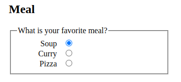

# Basic native form controls

This article covers:

- The common input types `button`, `checkbox`, `file`, `hidden`, `image`, `password`, `radio`, `reset`, `submit`, and `text`.
- Some of the attributes that are common to all form controls.

Text `<input>` fields are the most basic form widgets.

- They can be marked as
  - `readonly`; the user cannot modify the input value but it is still sent with the rest of the form data or
  - `disabled`; the input value can't be modified and is never sent with the rest of the form data.
- They can have a
  - `placeholder`; this is the text that appears inside the text input box that should be used to briefly describe the purpose of the box.
- They can be constrained in
  - `size`; the physical size of the box, and
  - `maxlength`; the maximum number of characters that can be entered into the box.
- They can benefit from spell checking (using the `spellcheck` attribute), if the browser supports it.

## Single line text fields

A single line text field is created using an `<input>` element whose `type` attribute value is set to `text`:

- or by omitting the `type` attribute altogether (`text` is the default value).
- The value `text` for this attribute is also the fallback value if the value you specify for the `type` attribute is unknown by the browser.
- If you type text with line breaks, the browser removes those line breaks before sending the data to the server.

```html
<input type="text" id="comment" name="comment" value="I'm a text field" />
```

## Password field

The `password` value doesn't add any special constraints to the entered text, but it does obscure the value entered into the field (e.g. with dots or asterisks) so it can't be easily read by others.

```html
<input type="password" id="pwd" name="pwd" />
```

Keep in mind this is just a user interface feature; unless you submit your form securely, it will get sent in plain text, which is bad for security.

## Hidden content

The `hidden` input type is used to create a form control that is invisible to the user, but is still sent to the server along with the rest of the form data once submitted.

```html
<input type="hidden" id="timestamp" name="timestamp" value="1286705410" />
```

Because it is hidden,
- the user can not see nor intentionally edit the value,
- it will never receive focus, and
- a screen reader will not notice it either.

If you create such an element,
- it's required to set its `name` and `value` attributes.
- The value can be dynamically set via JavaScript.
- The hidden input type should not have an associated label.

## Checkable items

Both the *checkbox* and the *radio button* use the `checked` attribute to indicate whether the widget is checked by default or not.

- For most form widgets,
  - once the form is submitted all widgets that have a `name` attribute are sent, even if no value has been filled out.
- In the case of checkable items,
  - their values are sent only if they are checked.
  - nothing is sent, not even their name, otherwise.
  - If they are checked but have no value, the `name` is sent with a value of `on`.

For maximum usability/accessibility,
- you are advised to surround each list of related items in a `<fieldset>`, with a `<legend>` providing an overall description of the list.
- Each individual pair of `<label>`/`<input>` elements should be contained in its own list item (or similar).

### Checkbox


Related checkbox items should use the same `name` attribute (`vegetable` in the example). Clicking the checkbox or its associated label toggles the checkbox on and off.

```html
<form>
  <h2>Vegetables</h2>
  <fieldset>
    <legend>
      Choose all the vegetables you like to eat
    </legend>
    <ul>
      <li>
        <label for="carrots">Carrots</label>
        <input type="checkbox" id="carrots" name="vegetable" value="carrots" checked />
      </li>
      <li>
        <label for="peas">Peas</label>
        <input type="checkbox" id="peas" name="vegetable" value="peas" />
      </li>
      <li>
        <label for="cabbage">Cabbage</label>
        <input type="checkbox" id="cabbage" name="vegetable" value="cabbage" />
      </li>
    </ul>
  </fieldset>
</form>
```

### Radio button



Several radio buttons can be tied together. If they share the same value for their `name` attribute (`meal` in the example), they will be considered to be in the same group of buttons.

```html
<form>
  <h2>Meal</h2>
  <fieldset>
    <legend>What is your favorite meal?</legend>
    <ul>
      <li>
        <label for="soup">Soup</label>
        <input type="radio" id="soup" name="meal" value="soup" checked />
      </li>
      <li>
        <label for="curry">Curry</label>
        <input type="radio" id="curry" name="meal" value="curry" />
      </li>
      <li>
        <label for="pizza">Pizza</label>
        <input type="radio" id="pizza" name="meal" value="pizza" />
      </li>
    </ul>
  </fieldset>
</form>
```

Only one button in a given group may be checked at a time; this means that when one of them is checked all the others automatically get unchecked.

- When the form is sent, only the value of the checked radio button is sent.
- If none of them are checked, the whole pool of radio buttons is considered to be in an unknown state and no value is sent with the form.
- Once one of the radio buttons in a same-named group of buttons is checked, it is not possible for the user to uncheck all the buttons without resetting the form.

