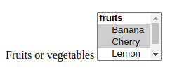

# Other form controls

We now look at the functionality of non-`<input>` form elements in detail, from other control types such as drop-down lists and multi-line text fields, to other useful form features such as the `<output>` element, and progress bars.

## Multi-line text fields

The main difference between a `<textarea>` and a regular single-line text field is that users are allowed to include hard line breaks (i.e. pressing return) that will be included when the data is submitted.

```html
<textarea cols="30" rows="8"></textarea>
```

`<textarea>` also takes a closing tag; any default text you want it to contain should be put between the opening and closing tags. In contrast, the `<input>` is a void element with no closing tag — any default value is put inside the `value` attribute.

Visually, the text entered wraps and the form control is by default resizable. Modern browsers provide a drag handle that you can drag to increase/decrease the size of the text area.

`<textarea>` accepts three attributes to control its rendering across several lines:

- `cols`: Specifies the visible width (columns) of the text control, measured in average character widths. The default value is 20.
- `rows`: Specifies the number of visible text rows for the control. The default value is 2.
- `wrap`: Specifies how the control wraps text.
  - `soft` (the default value), which means the text submitted is not wrapped but the text rendered by the browser is wrapped;
  - `hard` (the `cols` attribute must be specified when using this value), which means both the submitted and rendered texts are wrapped, and
  - `off`, which stops wrapping.

The ability to resize a `<textarea>` is controlled with the CSS resize property. Its possible values are: `both` (default), `horizontal`, `vertical`, and `none`.

## Drop-down controls

Drop-down controls are a simple way to let users select from many options without taking up much space in the user interface. HTML has two types of drop-down controls: the **select box** and the **autocomplete box**. The interaction is the same in both the types of drop-down controls — after the control is activated, the browser displays a list of values the user can select from.

### Select box


```html
<label for="fruit">Pick a fruit: </label>
<select id="fruit" name="fruit">
  <option>Banana</option>
  <option selected>Cherry</option>
  <option>Lemon</option>
</select>
```

### Using `<optgroup>`

The `<option>` elements can be nested inside `<optgroup>` elements to create visually associated groups of values:


```html
<label for="groups">A fruit or vegetable</label>
<select id="groups" name="groups">
  <optgroup label="fruits">
    <option>Banana</option>
    <option selected>Cherry</option>
    <option>Lemon</option>
  </optgroup>
  <optgroup label="vegetables">
    <option>Carrot</option>
    <option>Eggplant</option>
    <option>Potato</option>
  </optgroup>
</select>
```

If an `<option>` element has an explicit `value` attribute set on it, that value is sent when the form is submitted with that option selected. If the `value` attribute is omitted, as with the examples above, the content of the `<option>` element is used as the value. So `value` attributes are not needed, but you might find a reason to want to send a shortened or different value to the server than what is visually shown in the select box.

```html
<select id="simple" name="simple">
  <option value="banana">Big, beautiful yellow banana</option>
  <option value="cherry">Succulent, juicy cherry</option>
  <option value="lemon">Sharp, powerful lemon</option>
</select>
```

### Multiple choice select box

By default, a select box lets a user select only one value. By adding the multiple attribute to the `<select>` element, you can allow users to select several values. Users can select multiple values by using the default mechanism provided by the operating system (e.g., on the desktop, multiple values can be clicked while holding down `Cmd`/`Ctrl` keys).



```html
<select id="multi" name="multi" multiple size="4">
  <optgroup label="fruits">
    <option>Banana</option>
    <option selected>Cherry</option>
    <option>Lemon</option>
  </optgroup>
  <optgroup label="vegetables">
    <option>Carrot</option>
    <option>Eggplant</option>
    <option>Potato</option>
  </optgroup>
</select>
```

In the case of multiple choice select boxes, the select box no longer displays the values as drop-down content — instead, values are displayed at once in a list, with the optional `size` attribute determining the height of the widget.

> **Note**: MDN says that *all* values are displayed at once in a list. With Chromium browser Version 113.0 running on Debian 11, the list without the `size` attribute displays four options.
