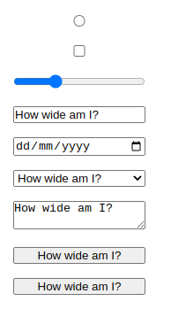

# Styling Web forms

The following form controls are easy to style:

- `<form>`
- `<fieldset>` and `<legend>`
- Single-line text input, e.g.
  - `<input type="text" />`
  - `<input type="url" />`
  - `<input type="email" />`
- Multi-line text input
  - `<textarea>`
- Buttons
  - `<button type="submit">`,
  - `<button type="button">`,
  - `<input type="submit">`,
  - `<input type="button">`
- `<label>`
- `<output>`

The following form controls are harder to style:

- `<input type="checkbox" />`
- `<input type="radio" />`
- `<input type="search" />`

Having internals can't be styled in CSS alone:

- `<input type="color" />`
- Date-related controls such as
  - `<input type="datetime-local" />`
- `<input type="range" />`
- `<input type="file" />`
- Dropdown widgets, including
  - `<select>`,
  - `<option>`,
  - `<optgroup>` and
  - `<datalist>`.
- Bar widgets
  - `<progress>`
  - `<meter>`

## Fonts and text

By default, some widgets do not inherit `font-family` and `font-size` from their parents. Many browsers use the system's default appearance instead. To make your forms' appearance consistent with the rest of your content, you can add the following rules to your stylesheet:

```css
button,
input,
select,
textarea {
  font-family: inherit;
  font-size: 100%;
}
```

Provided the above CSS with Chrome browser, `<input type="submit">` does not inherit from the parent paragraph, it rather uses the `font-family: system-ui`. This is another reason to use `<button>` elements over their equivalent input types!

There's a lot of debate as to whether forms look better using the system default styles, or customized styles designed to match your content. This decision is yours to make, as the designer of your site, or web application.

## Box sizing

All text fields have complete support for every property related to the CSS box model, such as `width`, `height`, `padding`, `margin`, and `border`.

If you want to keep the native look and feel of the widgets, you'll face a little difficulty if you want to give them a consistent size.This is because **each widget has its own rules for border, padding, and margin**.

In the screenshot below, the left column shows the default rendering of

- `<input type="radio">`
- `<input type="checkbox">`
- `<input type="range">`
- `<input type="text">`
- `<input type="date">`
- `<select>`
- `<textarea>`
- `<input type="submit">`
- `<button>`


The right column on the other hand shows the same elements with our rule applied to them. Notice how this lets us ensure that all of the elements occupy the same amount of space, despite the platform's default rules for each kind of widget.

```css
input,
textarea,
select,
button {
  width: 150px;
  padding: 0;
  margin: 0;
  box-sizing: border-box;
}
```

To give the same size to several different widgets, you can use the `box-sizing` property along with some consistent values for other properties.

Chromium of Debian Bullseye displays the controls as follows:



```html
<ul>
  <li>
    <input type="radio" />
  </li>
  <li>
    <input type="checkbox" />
  </li>
  <li>
    <input type="range" min="0" max="10" value="3" />
  </li>
  <li>
    <input type="text" value="How wide am I?" />
  </li>
  <li>
    <input type="date" />
  </li>
  <li>
    <select>
      <option>How wide am I?</option>
    </select>
  </li>
  <li>
    <textarea>How wide am I?</textarea>
  </li>
  <li>
    <input type="submit" value="How wide am I?" />
  </li>
  <li>
    <button type="submit">How wide am I?</button>
  </li>
</ul>
```

```css
ul {
  list-style: none;
  padding: 0;
  margin: 0;
}
form li + li {
  margin-top: 1em;
}
```
